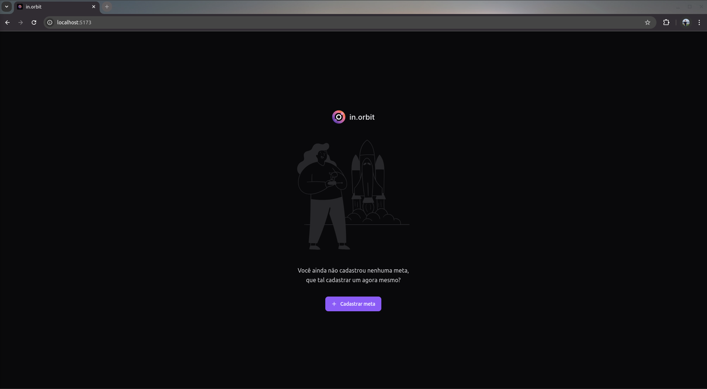
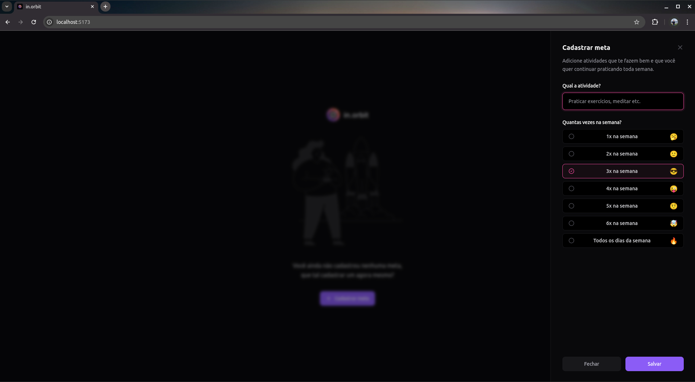
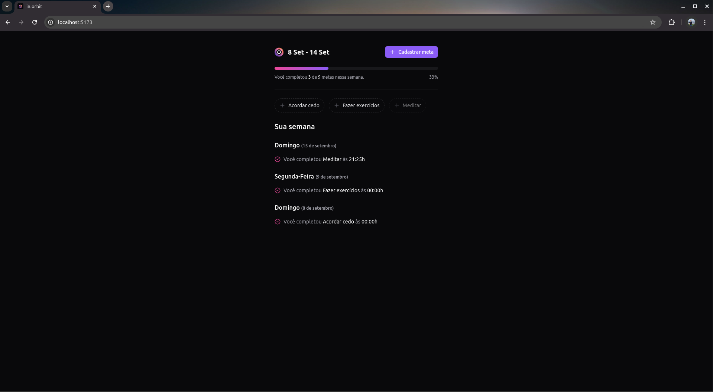

# NLW Pocket JavaScript - 2024

- Desenvolvimento de uma aplicação back-end em Node.js;
- Aplicação dos conceitos de API REST, utilizando TypeScript, Fastify como framework;
- Integração do DrizzleORM + PostgreSQL, Docker e Zod para validação de dados;
- Desenvolvimento de uma aplicação front-end em ReactJS;
- Aplicação dos conceitos de Propriedades, Estados e Componentes;
- Tipagem com Typescript;
- Tooling com Vite; 
- Interface responsiva com TailwindCSS;
- Consumo de API Node.js;
- Gerenciamento de dados assíncronos com TanStack Query.

## Funcionalidades do projeto

- Cadastrar metas semanais;
- Marcar metas semanais como concluídas;
- Visualizar metas semanais ordenadas por data e hora de conclusão.

## Gif e screenshots do projeto

## Como rodar o projeto

- Nas pastas "server" e "web", executar `npm i` para instalar todas as dependências da aplicação;
- Na pasta "server":
  - Executar `docker-compose up -d` para subir o BD da aplicação;
  - Executar `npx drizzle-kit generate` para gerar as tabelas;
  - Executar `npx drizzle-kit migrate` para rodar as migrações;
  - Executar `npm run seed` caso queira rodar a seed do BD;
  - Executar `npx drizzle-kit studio` caso queira visualizar as tabelas do BD.
- Na pasta "server" e na pasta "web", executar `npm run dev` para inicializar o backend e o frontend da aplicação, respectivamente.